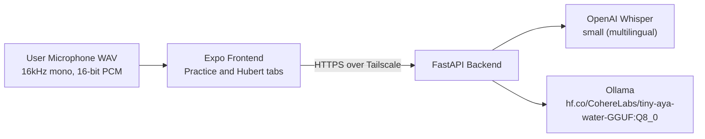

# Mimic

Mimic is an open-source language learning app with a friendly tutor persona named Hubert. The app focuses on pronunciation practice with per-character scoring and short tutoring replies with target-language translation.

## Architecture

- Monorepo structure:
  - `frontend`: React Native Expo + TypeScript + NativeWind
  - `backend`: FastAPI + Python 3.10+
- Ollama model: `hf.co/CohereLabs/tiny-aya-water-GGUF:Q8_0`
- Recommended GPU memory: at least 4GB VRAM
- Networking model: frontend and backend communicate over private Tailscale addresses



## Repository Layout

- `backend/main.py`: API app, alignment pipeline, Hubert tutor endpoint
- `backend/requirements.txt`: backend dependencies
- `backend/test_main.py`: backend tests for WAV validation and endpoints
- `frontend/App.tsx`: app bootstrap
- `frontend/src/navigation/RootTabs.tsx`: tab navigation (Practice and Hubert)
- `frontend/src/screens/PracticeScreen.tsx`: mimic pronunciation flow
- `frontend/src/screens/HubertChatScreen.tsx`: Hubert chat flow
- `frontend/src/components`: modular UI components
- `frontend/src/services/api.ts`: backend API client

## Security and Environment Variables

No secrets, keys, or fixed private IPs should be hardcoded.

1. Copy env templates:
   - root: `.env.example` to `.env`
   - backend: `backend/.env.example` to `backend/.env`
   - frontend: `frontend/.env.example` to `frontend/.env`
2. Fill values:
   - `EXPO_PUBLIC_API_BASE_URL` should point to your backend on Tailscale, for example `http://100.x.y.z:8000`
   - `OLLAMA_HOST` defaults to `http://localhost:11434`
  - `OLLAMA_MODEL` defaults to `hf.co/CohereLabs/tiny-aya-water-GGUF:Q8_0`
  - `WHISPER_MODEL` defaults to `small`
  - `WHISPER_LANGUAGE` defaults to empty (auto-detect)

Backend environment loading order:

- Root `.env` is loaded first
- `backend/.env` is loaded second and overrides root values

If you change `OLLAMA_MODEL`, restart Uvicorn so new environment values are applied.

## Backend Setup (Windows + CUDA 13.2)

### 1) Install prerequisites

1. Python 3.10 or newer
2. NVIDIA Driver with CUDA 13.2 support
3. FFmpeg in system `PATH`
4. Ollama installed and running locally

### 2) Install Python dependencies

```bash
cd backend
python -m venv .venv
.venv\Scripts\activate
pip install --upgrade pip
pip install -r requirements.txt
```

If you need CUDA-specific PyTorch wheels, use the wheel index that matches your machine and desired CUDA build.

### 3) Start Ollama model

```bash
ollama pull hf.co/CohereLabs/tiny-aya-water-GGUF:Q8_0
ollama serve
```

If you use a different local model tag, set it in `backend/.env`:

```env
OLLAMA_MODEL=your-model-tag
```

You can verify installed tags with:

```bash
ollama list
```

### 4) Run backend API

```bash
cd backend
uvicorn main:app --host 0.0.0.0 --port 8000 --reload
```

Health check:

```bash
curl http://localhost:8000/health
```

## API Contract

### POST /align

- Content type: `multipart/form-data`
- Fields:
  - `target_text`: string
  - `language`: optional ISO 639-1 code (`fr`, `de`, `ja`), empty means auto-detect
  - `audio_file`: WAV file, must be 16kHz, mono, 16-bit PCM
- Response:

```json
[
  { "character": "s", "score": 0.9 },
  { "character": "a", "score": 0.82 }
]
```

### POST /tutor_chat

- JSON body:

```json
{
  "message": "How do I greet someone politely?",
  "target_language": "French"
}
```

- Response:

```json
{
  "response": "Use 'Bonjour' for a polite greeting. Translation in French: Bonjour."
}
```

## Frontend Setup (Expo)

```bash
cd frontend
npm install
npm run start
```

The app includes two bottom tabs:

- Practice: target word input, listen playback, record and upload, per-character score colors
- Hubert: bubble chat with assistant speech playback

Target language behavior:

- Hubert chat: selected language is sent to backend and injected into Hubert's prompt context.
- Practice: selected language is used for local text-to-speech voice selection when pressing Listen.
- Alignment (`POST /align`) uses Whisper transcription + character matching.
  - Energy-based reliability gating is applied by default.
  - `language` can be provided by frontend to improve short-phrase accuracy.

Language picker behavior:

- Starts with featured options: Norwegian, Spanish, English, Korean, Chinese.
- Includes an extended language list with flag icons.
- Supports fuzzy search (example: typing `fren` narrows to French).
- In both Practice and Hubert screens, the UI uses keyboard-avoiding layouts so controls remain visible while typing.

Hubert model lifecycle:

- `POST /tutor_chat` is sent with `keep_alive=5m` by default so the model unloads automatically after 5 minutes of inactivity.
- A manual unload action is available in the Hubert chat UI (`Unload model`) and maps to `POST /tutor_unload`.
- Keep-alive can be configured with `OLLAMA_KEEP_ALIVE` in `backend/.env`.

Chat input behavior:

- The Hubert message input uses `returnKeyType="send"` and pressing the keyboard send key submits the message.

## Audio Recording Requirements

The Practice screen recording configuration uses these required parameters:

- `sampleRate: 16000`
- `numberOfChannels: 1`
- `bitRate: 256000`
- Android: `extension: '.m4a'` (AAC in MPEG-4)
- iOS: `extension: '.wav'` (linear PCM)

The backend enforces WAV format constraints and rejects invalid files.

## Testing

### Backend tests

```bash
cd backend
pytest -q
```

### Frontend tests

```bash
cd frontend
npm test
```

## Development Notes

- Hubert persona prompt is enforced in backend tutor-chat system prompt.
- CORS origins are configurable via `BACKEND_CORS_ORIGINS`.
- Keep all network endpoints environment-driven for Tailscale use.

Alignment observability in `backend/.env`:

- `ALIGN_LOG_METRICS`: set `1` to log `/align` request metrics.
- `ALIGN_MIN_DURATION_SEC`: minimum clip duration before scoring.
- `ALIGN_MIN_SPEECH_RATIO`: minimum active-speech ratio before scoring.
- `ALIGN_MIN_RMS`: minimum RMS energy before scoring.
- `WHISPER_MODEL`: model size (`tiny`, `base`, `small`, `medium`, `large`).
- `WHISPER_LANGUAGE`: optional fixed language code (leave empty for auto-detect).

## Troubleshooting

- If the first `POST /tutor_chat` call returns a client-side network timeout, the model may still be warming up in Ollama. Retry once after a short delay.
- If backend logs show no request while frontend shows `Network error`, verify `EXPO_PUBLIC_API_BASE_URL` points to the reachable backend host for your current device/network.
- If backend returns `model ... not found`, run `ollama list` and set `OLLAMA_MODEL` in `backend/.env` to an installed tag, then restart Uvicorn.
- If pronunciation upload fails on non-WAV sources, ensure FFmpeg is installed and available in `PATH`.

## Validation Workflow

After changes, run both suites:

```bash
cd backend
pytest -q
```

```bash
cd frontend
npm test -- --runInBand
```

For mobile bundle validation:

```bash
cd frontend
npx expo export --platform android
```
